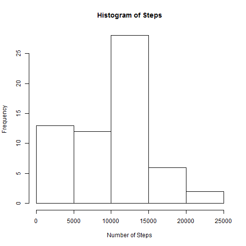
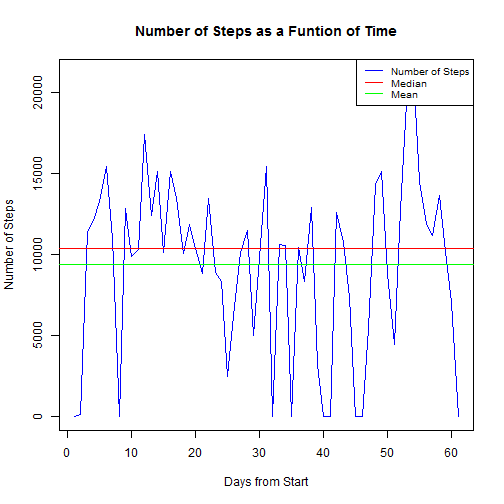
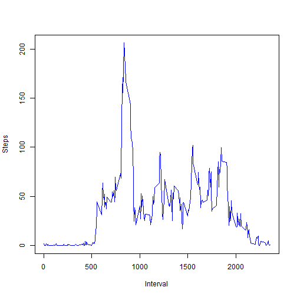
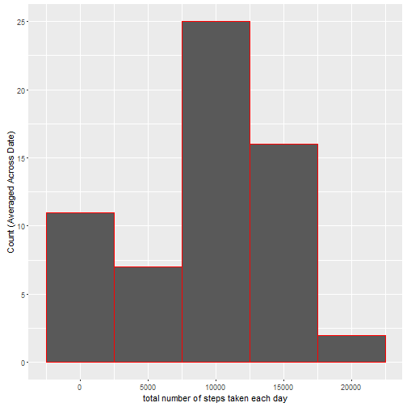
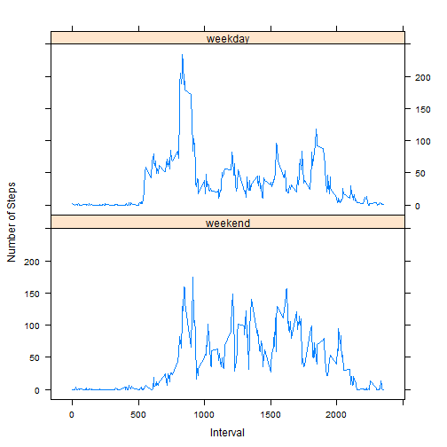

## Activity Monitoring Data
This report makes use of data from a personal activity monitoring device. This device collects data at 5 minute intervals through out the day. The data consists of two months of data from an anonymous individual collected during the months of October and November, 2012 and include the number of steps taken in 5 minute intervals each day.

The data for this assignment needs to be downloaded into the current working directory. The variables included in this dataset are:

-  steps: Number of steps taking in a 5-minute interval (missing values are coded as NA)

-  date: The date on which the measurement was taken in YYYY-MM-DD format

-  interval: Identifier for the 5-minute interval in which measurement was taken

The dataset is stored in a comma-separated-value (CSV) file and there are a total of 17,568 observations in this dataset.

### 1. Code for reading in the dataset and/or processing the data


```r
Act<-read.csv("Activity.csv")
str(Act)
```

```
## 'data.frame':	17568 obs. of  3 variables:
##  $ steps   : int  NA NA NA NA NA NA NA NA NA NA ...
##  $ date    : Factor w/ 61 levels "10/1/2012","10/10/2012",..: 1 1 1 1 1 1 1 1 1 1 ...
##  $ interval: int  0 5 10 15 20 25 30 35 40 45 ...
```

### 2. Histogram of the total number of steps taken each day


```r
##A<-na.omit(Act)
A<-Act
A<-mutate(A, Ndate = as.Date(date,format="%m/%d/%Y"))
Act<-mutate(Act, Date = as.Date(date,format="%m/%d/%Y"))
B<-tapply(A$steps,A$Ndate, FUN = sum, na.rm = TRUE)
hist(B,main="Histogram of Steps",xlab="Number of Steps")
```



### 3. Mean and median number of steps taken each day
I decided to you use the graph of the total steps as a funtion of day (time).  The mean for this graph can be envisioned as the green horizontal line the divides the area under the graph.  The top part of thegraph (above the green line) is backfill required to fill in the gaps below the green line.  This will give rise to a rectangular shaped graph whose y value is the mean.

```r
Mean<-mean(B)
Median<-median(B)
 plot(B,type="l",col="blue",xlab="Days from Start",ylab="Number of Steps", main="Number of Steps as a Funtion of Time" )
 abline(h=Median,col="red")
abline(h=Mean,col="green")
 legend("topright",legend=c("Number of Steps","Median","Mean"),col=c("blue","red","green"), lty=1, cex=0.8)
```



```r
mean(B,na.rm=TRUE)
```

```
## [1] 9354.23
```

```r
median(B, na.rm=TRUE)
```

```
## [1] 10395
```

### 4. Time series plot of the average number of steps taken


```r
sbi <- aggregate(steps ~ interval, A, mean)
plot(sbi$interval,sbi$steps, type="l",col="blue",xlab="Interval",ylab="Steps")
```




```r
###  5.The 5-minute interval that, on average, contains the maximum number of steps
mi <- sbi[which.max(sbi$steps),1]

### the maximum interval is .. 
mi
```

```
## [1] 835
```


### 6.  Code to describe and show a strategy for imputing missing data
### Part A - Using the steps being averaged by date
In this part the imputed values used to replace the NA's, are computed by averaging the
the steps for that particular date.


```r
Intavg <- aggregate(x = list(steps = A$steps), by = list(interval = A$interval),
                       FUN = mean, na.rm = TRUE)
 Dateavg <- aggregate(x = list(steps = A$steps), by = list(Date = A$Ndate),
                      FUN = mean, na.rm = TRUE)	


 for(i in 1:nrow(Dateavg)){
         if(is.na(Dateavg$steps[i])){
                 Dateavg$steps[i]<-0.0001
        }
 }
FV <- function(steps, interval) {
    fil <- NA
    if (!is.na(steps))
        fil <- c(steps)
    else
        fil <- (Intavg[Intavg$interval==interval, "steps"])
    fil
}
fd <- A
fd$steps <- mapply(FV, fd$steps, fd$interval)
##
Totsteps <- tapply(fd$steps, fd$Ndate, FUN = sum)
qplot(Totsteps, binwidth = 5000, xlab = "total number of steps taken each day",ylab="Count (Averaged Across Time Interval)",colour=I("blue"))
```


```r
mean(Totsteps)
```

```
## [1] 10766.19
```

```r
median(Totsteps)
```

```
## [1] 10766.19
```
### Part B - Using the steps being averaged by interval
In this part the imputed values used to replace the NA's, are computed by averaging the
the steps for that particular 5 minute interva..


```r
DFV <- function(steps, Date) {
    fil <- NA
    if (!is.na(steps))
        fil <- c(steps)
    else
        fil <- (Dateavg[Dateavg$Date==Date, "steps"])
    fil
}
fd <- A
fd$steps <- mapply(DFV, fd$steps, fd$Ndate)
Totsteps <- tapply(fd$steps, fd$Ndate, FUN = sum)
for(i in 1:nrow(Totsteps)){
         if(is.na(Totsteps[i])){
                 Totsteps[i]<-1.0
        }
 }


qplot(Totsteps, binwidth = 5000, xlab = "total number of steps taken each day",ylab="Count (Averaged Across Date)",colour=I("red"))
```



```r
mean(Totsteps)
```

```
## [1] 9354.233
```

```r
median(Totsteps)
```

```
## [1] 10395
```
                     
                      
                     
### 8.  Panel plot comparing the average number of steps taken per 5-minute 
###     interval across weekdays and weekends


```r
library(lattice)
#this line will biconditionally separate weekdays and weekends values into the
#DOY column
A$DOW <- ifelse(weekdays(A$Ndate,abbreviate=TRUE)=="Sat"|
 weekdays(A$Ndate,abbreviate=TRUE)=="Sun","weekend", "weekday")

# separate into two dataframes
wd<-filter(A,DOW=="weekday")
we<-filter(A,DOW=="weekend")

#compute the mean value of steps across 5 minute time intervals
WEavg <- aggregate(x = list(steps = we$steps), by = list(interval = we$interval),
                       FUN = mean, na.rm = TRUE)
WDavg <- aggregate(x = list(steps = wd$steps), by = list(interval = wd$interval),
                        FUN = mean, na.rm = TRUE)

#add DOY into each data frame
WEavg<-data.frame(WEavg,DOW="weekend")
WDavg<-data.frame(WDavg,DOW="weekday")

# bind together weekend and weekdat data frames into one (Avg)
Avg<-rbind(WEavg,WDavg)

xyplot(Avg$steps ~ Avg$interval|Avg$DOW, main="",xlab="Interval", ylab="Number of Steps",layout=c(1,2), type="l")
```




